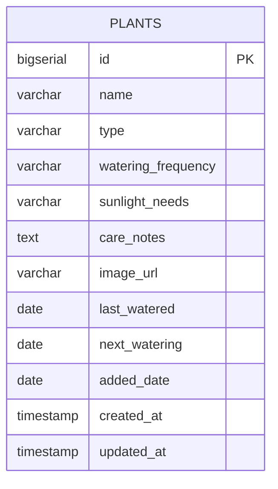

# Home Care Plants - Complete Spring Boot Project Documentation

## Table of Contents
1. [Project Overview](#project-overview)
2. [Architecture & Design](#architecture--design)
3. [Project Structure](#project-structure)
4. [Database Schema](#database-schema)
5. [RESTful API Documentation](#restful-api-documentation)
6. [Spring Boot Configuration](#spring-boot-configuration)
7. [Setup & Installation](#setup--installation)
8. [Testing](#testing)
9. [Deployment](#deployment)
10. [Troubleshooting](#troubleshooting)

---

## Project Overview

### Purpose
The Home Care Plants application is a comprehensive plant management system that allows users to track, manage, and care for their indoor plants. The backend provides RESTful APIs for plant CRUD operations, watering schedules, and plant care management.

### Technology Stack
- **Backend Framework**: Spring Boot 3.2.0
- **Database**: PostgreSQL 12+
- **ORM**: Spring Data JPA with Hibernate
- **Build Tool**: Maven 3.6+
- **Java Version**: 17
- **Testing**: JUnit 5, MockMvc
- **Documentation**: Markdown, OpenAPI (Swagger)

### Key Features
- ✅ Complete CRUD operations for plants
- ✅ Plant watering schedule management
- ✅ Plant categorization and filtering
- ✅ Search functionality
- ✅ Plant care notes and reminders
- ✅ RESTful API with JSON responses
- ✅ CORS support for frontend integration
- ✅ Input validation and error handling
- ✅ Comprehensive testing suite

---

## Architecture & Design

### System Architecture
```
┌─────────────────┐    ┌─────────────────┐    ┌─────────────────┐
│   Frontend      │    │   Spring Boot   │    │   PostgreSQL    │
│   (HTML/CSS/JS) │◄──►│   Backend API   │◄──►│   Database      │
│                 │    │                 │    │                 │
└─────────────────┘    └─────────────────┘    └─────────────────┘
```

### Design Patterns
- **MVC Pattern**: Model-View-Controller separation
- **Repository Pattern**: Data access abstraction
- **DTO Pattern**: Data transfer objects
- **Builder Pattern**: Object construction
- **Singleton Pattern**: Spring beans

### Layered Architecture
```
┌─────────────────────────────────────────┐
│              Controller Layer           │  ← REST API Endpoints
├─────────────────────────────────────────┤
│              Service Layer              │  ← Business Logic
├─────────────────────────────────────────┤
│              Repository Layer           │  ← Data Access
├─────────────────────────────────────────┤
│              Entity Layer               │  ← Data Models
└─────────────────────────────────────────┘
```

---

## Project Structure

```
home-care-plants-backend/
├── pom.xml                                    # Maven configuration
├── README.md                                  # Basic project information
├── API_DOCUMENTATION.md                       # API reference
├── COMPLETE_PROJECT_DOCUMENTATION.md          # This comprehensive guide
└── src/
    ├── main/
    │   ├── java/com/homecare/
    │   │   ├── HomeCarePlantsApplication.java # Main application class
    │   │   ├── config/
    │   │   │   ├── CorsConfig.java           # CORS configuration
    │   │   │   └── DataSeeder.java           # Sample data seeder
    │   │   ├── controller/
    │   │   │   └── PlantController.java      # REST API endpoints
    │   │   ├── entity/
    │   │   │   └── Plant.java                # Plant entity model
    │   │   ├── repository/
    │   │   │   └── PlantRepository.java      # Data access layer
    │   │   └── service/
    │   │       └── PlantService.java         # Business logic layer
    │   └── resources/
    │       ├── application.properties        # Main configuration
    │       ├── application-dev.properties    # Development config
    │       └── application-prod.properties   # Production config
    └── test/
        ├── java/com/homecare/
        │   ├── controller/
        │   │   └── PlantControllerTest.java  # Controller tests
        │   ├── service/
        │   │   └── PlantServiceTest.java     # Service tests
        │   └── repository/
        │       └── PlantRepositoryTest.java  # Repository tests
        └── resources/
            └── application-test.properties   # Test configuration
```

### Package Structure Explanation

#### `com.homecare` - Root Package
- Contains the main application class and all sub-packages

#### `com.homecare.config` - Configuration Package
- **CorsConfig.java**: CORS configuration for frontend integration
- **DataSeeder.java**: Sample data initialization

#### `com.homecare.controller` - Controller Package
- **PlantController.java**: REST API endpoints for plant operations

#### `com.homecare.entity` - Entity Package
- **Plant.java**: JPA entity representing the plant table

#### `com.homecare.repository` - Repository Package
- **PlantRepository.java**: Data access layer using Spring Data JPA

#### `com.homecare.service` - Service Package
- **PlantService.java**: Business logic layer (if implemented)

---

## Database Schema

### Plant Table Schema

```sql
CREATE TABLE plants (
    id BIGSERIAL PRIMARY KEY,
    name VARCHAR(100) NOT NULL,
    type VARCHAR(50) NOT NULL,
    watering_frequency VARCHAR(50) NOT NULL,
    sunlight_needs VARCHAR(50) NOT NULL,
    care_notes TEXT,
    image_url VARCHAR(500),
    last_watered DATE,
    next_watering DATE,
    added_date DATE NOT NULL,
    created_at TIMESTAMP NOT NULL DEFAULT CURRENT_TIMESTAMP,
    updated_at TIMESTAMP NOT NULL DEFAULT CURRENT_TIMESTAMP
);

-- Indexes for better performance
CREATE INDEX idx_plants_type ON plants(type);
CREATE INDEX idx_plants_watering_frequency ON plants(watering_frequency);
CREATE INDEX idx_plants_sunlight_needs ON plants(sunlight_needs);
CREATE INDEX idx_plants_next_watering ON plants(next_watering);
CREATE INDEX idx_plants_name ON plants(name);
```

### Entity Relationship Diagram



### Field Descriptions

| Field | Type | Constraints | Description |
|-------|------|-------------|-------------|
| `id` | BIGSERIAL | PRIMARY KEY | Auto-incrementing unique identifier |
| `name` | VARCHAR(100) | NOT NULL | Plant name (max 100 characters) |
| `type` | VARCHAR(50) | NOT NULL | Plant type (tropical, succulent, etc.) |
| `watering_frequency` | VARCHAR(50) | NOT NULL | How often to water (daily, weekly, etc.) |
| `sunlight_needs` | VARCHAR(50) | NOT NULL | Light requirements (low, medium, high) |
| `care_notes` | TEXT | NULL | Additional care instructions |
| `image_url` | VARCHAR(500) | NULL | URL to plant image |
| `last_watered` | DATE | NULL | Date when plant was last watered |
| `next_watering` | DATE | NULL | Date when plant should be watered next |
| `added_date` | DATE | NOT NULL | Date when plant was added to collection |
| `created_at` | TIMESTAMP | NOT NULL | Record creation timestamp |
| `updated_at` | TIMESTAMP | NOT NULL | Record last update timestamp |

---

## RESTful API Documentation

### Base URL
```
http://localhost:8080/api
```

### Authentication
No authentication required for this API.

### Content Type
All requests and responses use `application/json`.

### HTTP Status Codes

| Code | Description |
|------|-------------|
| 200 | OK - Request successful |
| 201 | Created - Resource created successfully |
| 204 | No Content - Request successful, no content returned |
| 400 | Bad Request - Invalid request data |
| 404 | Not Found - Resource not found |
| 500 | Internal Server Error - Server error |

### API Endpoints

#### 1. Plant Management

##### Get All Plants
```http
GET /api/plants
```

**Description**: Retrieves all plants in the database.

**Response**:
```json
[
  {
    "id": 1,
    "name": "Fiddle Leaf Fig",
    "type": "tropical",
    "wateringFrequency": "weekly",
    "sunlightNeeds": "medium",
    "careNotes": "Keep away from direct sunlight",
    "imageUrl": "https://example.com/image.jpg",
    "lastWatered": "2024-01-15",
    "nextWatering": "2024-01-22",
    "addedDate": "2024-01-01",
    "createdAt": "2024-01-01T10:00:00",
    "updatedAt": "2024-01-01T10:00:00"
  }
]
```

##### Get Plant by ID
```http
GET /api/plants/{id}
```

**Parameters**:
- `id` (path, required): Plant ID

**Response**:
```json
{
  "id": 1,
  "name": "Fiddle Leaf Fig",
  "type": "tropical",
  "wateringFrequency": "weekly",
  "sunlightNeeds": "medium",
  "careNotes": "Keep away from direct sunlight",
  "imageUrl": "https://example.com/image.jpg",
  "lastWatered": "2024-01-15",
  "nextWatering": "2024-01-22",
  "addedDate": "2024-01-01",
  "createdAt": "2024-01-01T10:00:00",
  "updatedAt": "2024-01-01T10:00:00"
}
```

##### Create Plant
```http
POST /api/plants
```

**Request Body**:
```json
{
  "name": "Snake Plant",
  "type": "succulent",
  "wateringFrequency": "every-2-weeks",
  "sunlightNeeds": "low",
  "careNotes": "Very low maintenance plant",
  "imageUrl": "https://example.com/snake-plant.jpg"
}
```

**Required Fields**:
- `name`: Plant name (max 100 characters)
- `type`: Plant type (max 50 characters)
- `wateringFrequency`: Watering frequency (max 50 characters)
- `sunlightNeeds`: Sunlight requirements (max 50 characters)

**Optional Fields**:
- `careNotes`: Care instructions (max 1000 characters)
- `imageUrl`: Image URL (max 500 characters)

**Response**:
```json
{
  "id": 2,
  "name": "Snake Plant",
  "type": "succulent",
  "wateringFrequency": "every-2-weeks",
  "sunlightNeeds": "low",
  "careNotes": "Very low maintenance plant",
  "imageUrl": "https://example.com/snake-plant.jpg",
  "lastWatered": "2024-01-20",
  "nextWatering": "2024-02-03",
  "addedDate": "2024-01-20",
  "createdAt": "2024-01-20T10:00:00",
  "updatedAt": "2024-01-20T10:00:00"
}
```

##### Update Plant
```http
PUT /api/plants/{id}
```

**Parameters**:
- `id` (path, required): Plant ID

**Request Body**:
```json
{
  "name": "Updated Snake Plant",
  "type": "succulent",
  "wateringFrequency": "monthly",
  "sunlightNeeds": "low",
  "careNotes": "Updated care instructions"
}
```

**Response**:
```json
{
  "id": 2,
  "name": "Updated Snake Plant",
  "type": "succulent",
  "wateringFrequency": "monthly",
  "sunlightNeeds": "low",
  "careNotes": "Updated care instructions",
  "imageUrl": "https://example.com/snake-plant.jpg",
  "lastWatered": "2024-01-15",
  "nextWatering": "2024-02-15",
  "addedDate": "2024-01-01",
  "createdAt": "2024-01-01T10:00:00",
  "updatedAt": "2024-01-20T11:00:00"
}
```

##### Delete Plant
```http
DELETE /api/plants/{id}
```

**Parameters**:
- `id` (path, required): Plant ID

**Response**: `204 No Content`

#### 2. Plant Actions

##### Water Plant
```http
POST /api/plants/{id}/water
```

**Description**: Marks a plant as watered and updates the next watering date.

**Parameters**:
- `id` (path, required): Plant ID

**Response**:
```json
{
  "id": 1,
  "name": "Fiddle Leaf Fig",
  "type": "tropical",
  "wateringFrequency": "weekly",
  "sunlightNeeds": "medium",
  "careNotes": "Keep away from direct sunlight",
  "imageUrl": "https://example.com/image.jpg",
  "lastWatered": "2024-01-20",
  "nextWatering": "2024-01-27",
  "addedDate": "2024-01-01",
  "createdAt": "2024-01-01T10:00:00",
  "updatedAt": "2024-01-20T12:00:00"
}
```

#### 3. Search & Filter

##### Get Plants by Type
```http
GET /api/plants/type/{type}
```

**Parameters**:
- `type` (path, required): Plant type

**Response**: Array of plants matching the type

##### Get Plants Needing Water
```http
GET /api/plants/needs-watering
```

**Description**: Returns plants that need watering (next watering date is today or past).

**Response**: Array of plants needing water

##### Search Plants
```http
GET /api/plants/search?name={name}
```

**Parameters**:
- `name` (query, required): Search term

**Description**: Searches for plants by name (case-insensitive).

**Response**: Array of plants matching the search term

##### Get Plant Statistics
```http
GET /api/plants/stats
```

**Response**:
```json
{
  "totalPlants": 15,
  "plantsNeedingWatering": 3
}
```

### Error Responses

#### 400 Bad Request
```json
{
  "timestamp": "2024-01-20T10:00:00",
  "status": 400,
  "error": "Bad Request",
  "message": "Validation failed",
  "path": "/api/plants"
}
```

#### 404 Not Found
```json
{
  "timestamp": "2024-01-20T10:00:00",
  "status": 404,
  "error": "Not Found",
  "message": "Plant not found",
  "path": "/api/plants/999"
}
```

#### 500 Internal Server Error
```json
{
  "timestamp": "2024-01-20T10:00:00",
  "status": 500,
  "error": "Internal Server Error",
  "message": "An unexpected error occurred",
  "path": "/api/plants"
}
```

---

## Spring Boot Configuration

### Application Properties

#### Main Configuration (`application.properties`)
```properties
# Database Configuration
spring.datasource.url=jdbc:postgresql://localhost:5433/Home_care_plants
spring.datasource.username=postgres
spring.datasource.password=Admin09
spring.datasource.driver-class-name=org.postgresql.Driver

# JPA/Hibernate Configuration
spring.jpa.hibernate.ddl-auto=update
spring.jpa.show-sql=true
spring.jpa.properties.hibernate.dialect=org.hibernate.dialect.PostgreSQLDialect
spring.jpa.properties.hibernate.format_sql=true

# Server Configuration
server.port=8080

# CORS Configuration
spring.web.cors.allowed-origins=http://localhost:3000,http://127.0.0.1:3000,http://localhost:5500,http://127.0.0.1:5500,file://
spring.web.cors.allowed-methods=GET,POST,PUT,DELETE,OPTIONS
spring.web.cors.allowed-headers=*
spring.web.cors.allow-credentials=true

# Logging Configuration
logging.level.com.homecare=DEBUG
logging.level.org.springframework.web=DEBUG
```

#### Test Configuration (`application-test.properties`)
```properties
# Test Database Configuration (H2 in-memory database)
spring.datasource.url=jdbc:h2:mem:testdb
spring.datasource.driver-class-name=org.h2.Driver
spring.datasource.username=sa
spring.datasource.password=

# JPA/Hibernate Configuration for Testing
spring.jpa.hibernate.ddl-auto=create-drop
spring.jpa.show-sql=true
spring.jpa.properties.hibernate.dialect=org.hibernate.dialect.H2Dialect

# Disable data seeder for tests
spring.jpa.defer-datasource-initialization=false

# Logging Configuration
logging.level.com.homecare=DEBUG
```

### Maven Configuration (`pom.xml`)

```xml
<?xml version="1.0" encoding="UTF-8"?>
<project xmlns="http://maven.apache.org/POM/4.0.0" xmlns:xsi="http://www.w3.org/2001/XMLSchema-instance"
         xsi:schemaLocation="http://maven.apache.org/POM/4.0.0 https://maven.apache.org/xsd/maven-4.0.0.xsd">
    <modelVersion>4.0.0</modelVersion>
    <parent>
        <groupId>org.springframework.boot</groupId>
        <artifactId>spring-boot-starter-parent</artifactId>
        <version>3.2.0</version>
        <relativePath/>
    </parent>
    <groupId>com.homecare</groupId>
    <artifactId>home-care-plants-backend</artifactId>
    <version>0.0.1-SNAPSHOT</version>
    <name>home-care-plants-backend</name>
    <description>Backend API for Home Care Plants application</description>
    <properties>
        <java.version>17</java.version>
    </properties>
    <dependencies>
        <dependency>
            <groupId>org.springframework.boot</groupId>
            <artifactId>spring-boot-starter-data-jpa</artifactId>
        </dependency>
        <dependency>
            <groupId>org.springframework.boot</groupId>
            <artifactId>spring-boot-starter-web</artifactId>
        </dependency>
        <dependency>
            <groupId>org.postgresql</groupId>
            <artifactId>postgresql</artifactId>
            <scope>runtime</scope>
        </dependency>
        <dependency>
            <groupId>org.springframework.boot</groupId>
            <artifactId>spring-boot-starter-validation</artifactId>
        </dependency>
        <dependency>
            <groupId>org.springframework.boot</groupId>
            <artifactId>spring-boot-starter-test</artifactId>
            <scope>test</scope>
        </dependency>
        <dependency>
            <groupId>com.h2database</groupId>
            <artifactId>h2</artifactId>
            <scope>test</scope>
        </dependency>
    </dependencies>
    <build>
        <plugins>
            <plugin>
                <groupId>org.springframework.boot</groupId>
                <artifactId>spring-boot-maven-plugin</artifactId>
            </plugin>
        </plugins>
    </build>
</project>
```

---

## Setup & Installation

### Prerequisites

1. **Java Development Kit (JDK) 17 or higher**
   ```bash
   java -version
   ```

2. **Apache Maven 3.6 or higher**
   ```bash
   mvn -version
   ```

3. **PostgreSQL 12 or higher**
   - Download from: https://www.postgresql.org/download/
   - Install and start PostgreSQL service
   - Create database: `Home_care_plants`

4. **IDE (Optional but recommended)**
   - IntelliJ IDEA
   - Eclipse
   - Visual Studio Code

### Installation Steps

#### 1. Clone/Download Project
```bash
# If using Git
git clone <repository-url>
cd home-care-plants-backend

# Or download and extract the project files
```

#### 2. Database Setup
```sql
-- Connect to PostgreSQL
psql -U postgres

-- Create database
CREATE DATABASE "Home_care_plants";

-- Verify database creation
\l
```

#### 3. Configure Database Connection
Edit `src/main/resources/application.properties`:
```properties
# Update these values if your PostgreSQL configuration is different
spring.datasource.url=jdbc:postgresql://localhost:5433/Home_care_plants
spring.datasource.username=postgres
spring.datasource.password=Admin09
```

#### 4. Build Project
```bash
mvn clean compile
```

#### 5. Run Application
```bash
# Method 1: Using Maven
mvn spring-boot:run

# Method 2: Using JAR file
mvn clean package
java -jar target/home-care-plants-backend-0.0.1-SNAPSHOT.jar

# Method 3: Using IDE
# Run HomeCarePlantsApplication.java
```

#### 6. Verify Installation
```bash
# Test API endpoint
curl http://localhost:8080/api/plants

# Or open in browser
# http://localhost:8080/api/plants
```

### Development Setup

#### 1. IDE Configuration
- Import as Maven project
- Configure JDK 17
- Enable annotation processing
- Install Lombok plugin (if using)

#### 2. Database Tools
- Install pgAdmin or DBeaver
- Connect to PostgreSQL database
- Monitor database changes

#### 3. API Testing
- Install Postman or use curl
- Import API collection
- Test all endpoints

---

## Testing

### Test Structure
```
src/test/
├── java/com/homecare/
│   ├── controller/
│   │   └── PlantControllerTest.java
│   ├── service/
│   │   └── PlantServiceTest.java
│   └── repository/
│       └── PlantRepositoryTest.java
└── resources/
    └── application-test.properties
```

### Running Tests

#### All Tests
```bash
mvn test
```

#### Specific Test Class
```bash
mvn test -Dtest=PlantControllerTest
```

#### Specific Test Method
```bash
mvn test -Dtest=PlantControllerTest#testGetAllPlants
```

### Test Coverage
```bash
# Generate test coverage report
mvn jacoco:report

# View coverage report
open target/site/jacoco/index.html
```

### Test Examples

#### Controller Test
```java
@Test
public void testGetAllPlants() throws Exception {
    mockMvc.perform(get("/api/plants"))
            .andExpect(status().isOk())
            .andExpect(content().contentType(MediaType.APPLICATION_JSON));
}
```

#### Service Test
```java
@Test
public void testCreatePlant() {
    Plant plant = new Plant();
    plant.setName("Test Plant");
    plant.setType("tropical");
    
    Plant savedPlant = plantService.createPlant(plant);
    
    assertNotNull(savedPlant.getId());
    assertEquals("Test Plant", savedPlant.getName());
}
```

---

## Deployment

### Development Deployment

#### Local Development
```bash
# Run with development profile
mvn spring-boot:run -Dspring.profiles.active=dev
```

#### Docker Deployment
```dockerfile
# Dockerfile
FROM openjdk:17-jdk-slim
COPY target/home-care-plants-backend-0.0.1-SNAPSHOT.jar app.jar
EXPOSE 8080
ENTRYPOINT ["java", "-jar", "/app.jar"]
```

```bash
# Build Docker image
docker build -t home-care-plants-backend .

# Run Docker container
docker run -p 8080:8080 home-care-plants-backend
```

### Production Deployment

#### Environment Variables
```bash
export SPRING_DATASOURCE_URL=jdbc:postgresql://prod-db:5432/Home_care_plants
export SPRING_DATASOURCE_USERNAME=prod_user
export SPRING_DATASOURCE_PASSWORD=prod_password
export SPRING_PROFILES_ACTIVE=prod
```

#### Production Configuration
```properties
# application-prod.properties
spring.datasource.url=${SPRING_DATASOURCE_URL}
spring.datasource.username=${SPRING_DATASOURCE_USERNAME}
spring.datasource.password=${SPRING_DATASOURCE_PASSWORD}

# Security
spring.jpa.hibernate.ddl-auto=validate
logging.level.com.homecare=INFO

# Performance
spring.jpa.properties.hibernate.jdbc.batch_size=20
spring.jpa.properties.hibernate.order_inserts=true
spring.jpa.properties.hibernate.order_updates=true
```

#### Cloud Deployment
- **AWS**: Elastic Beanstalk, ECS, or EC2
- **Google Cloud**: App Engine or Cloud Run
- **Azure**: App Service or Container Instances
- **Heroku**: Platform as a Service

---

## Troubleshooting

### Common Issues

#### 1. Database Connection Error
**Error**: `Connection refused` or `Database not found`

**Solutions**:
- Verify PostgreSQL is running
- Check database credentials
- Ensure database exists
- Verify port 5433 is correct

#### 2. Port Already in Use
**Error**: `Port 8080 was already in use`

**Solutions**:
```bash
# Find process using port 8080
netstat -ano | findstr :8080

# Kill process
taskkill /PID <process_id> /F

# Or change port in application.properties
server.port=8081
```

#### 3. Compilation Errors
**Error**: `Compilation failure`

**Solutions**:
- Check Java version (must be 17+)
- Clean and rebuild: `mvn clean compile`
- Check for missing dependencies
- Verify Maven configuration

#### 4. CORS Issues
**Error**: `CORS policy` errors in browser

**Solutions**:
- Check CORS configuration in `CorsConfig.java`
- Verify allowed origins
- Ensure frontend URL is in allowed list

#### 5. JPA/Hibernate Issues
**Error**: `Table doesn't exist` or `Schema validation failed`

**Solutions**:
- Check `spring.jpa.hibernate.ddl-auto` setting
- Verify database schema
- Check entity annotations
- Run database migrations

### Debugging

#### Enable Debug Logging
```properties
logging.level.com.homecare=DEBUG
logging.level.org.springframework.web=DEBUG
logging.level.org.hibernate.SQL=DEBUG
logging.level.org.hibernate.type.descriptor.sql.BasicBinder=TRACE
```

#### Database Debugging
```sql
-- Check if table exists
SELECT * FROM information_schema.tables WHERE table_name = 'plants';

-- Check table structure
\d plants;

-- Check data
SELECT * FROM plants;
```

#### API Debugging
```bash
# Test with verbose output
curl -v http://localhost:8080/api/plants

# Test with specific headers
curl -H "Content-Type: application/json" http://localhost:8080/api/plants
```

### Performance Optimization

#### Database Optimization
- Add indexes for frequently queried columns
- Use connection pooling
- Optimize queries
- Monitor slow queries

#### Application Optimization
- Enable caching
- Optimize JPA queries
- Use pagination for large datasets
- Monitor memory usage

---

## API Usage Examples

### JavaScript/Frontend Integration

#### Fetch All Plants
```javascript
async function loadPlants() {
    try {
        const response = await fetch('http://localhost:8080/api/plants');
        const plants = await response.json();
        displayPlants(plants);
    } catch (error) {
        console.error('Error loading plants:', error);
    }
}
```

#### Create New Plant
```javascript
async function createPlant(plantData) {
    try {
        const response = await fetch('http://localhost:8080/api/plants', {
            method: 'POST',
            headers: {
                'Content-Type': 'application/json',
            },
            body: JSON.stringify(plantData)
        });
        
        if (response.ok) {
            const newPlant = await response.json();
            console.log('Plant created:', newPlant);
            return newPlant;
        } else {
            throw new Error('Failed to create plant');
        }
    } catch (error) {
        console.error('Error creating plant:', error);
    }
}
```

#### Water Plant
```javascript
async function waterPlant(plantId) {
    try {
        const response = await fetch(`http://localhost:8080/api/plants/${plantId}/water`, {
            method: 'POST'
        });
        
        if (response.ok) {
            const updatedPlant = await response.json();
            console.log('Plant watered:', updatedPlant);
            return updatedPlant;
        } else {
            throw new Error('Failed to water plant');
        }
    } catch (error) {
        console.error('Error watering plant:', error);
    }
}
```

### cURL Examples

#### Get All Plants
```bash
curl -X GET http://localhost:8080/api/plants
```

#### Create Plant
```bash
curl -X POST http://localhost:8080/api/plants \
  -H "Content-Type: application/json" \
  -d '{
    "name": "Monstera",
    "type": "tropical",
    "wateringFrequency": "weekly",
    "sunlightNeeds": "medium",
    "careNotes": "Loves humidity"
  }'
```

#### Update Plant
```bash
curl -X PUT http://localhost:8080/api/plants/1 \
  -H "Content-Type: application/json" \
  -d '{
    "name": "Updated Monstera",
    "type": "tropical",
    "wateringFrequency": "weekly",
    "sunlightNeeds": "medium",
    "careNotes": "Updated care notes"
  }'
```

#### Delete Plant
```bash
curl -X DELETE http://localhost:8080/api/plants/1
```

#### Water Plant
```bash
curl -X POST http://localhost:8080/api/plants/1/water
```

---

## Conclusion

This comprehensive documentation covers all aspects of the Home Care Plants Spring Boot backend project. The system provides a robust, scalable solution for plant management with:

- **Complete CRUD operations** for plant management
- **RESTful API design** following best practices
- **Database integration** with PostgreSQL
- **Comprehensive testing** suite
- **Production-ready** configuration
- **Detailed documentation** for developers

The project is ready for development, testing, and deployment in various environments. For additional support or questions, refer to the Spring Boot documentation or contact the development team.

---

**Document Version**: 1.0  
**Last Updated**: September 2024  
**Author**: Development Team  
**Project**: Home Care Plants Backend API
